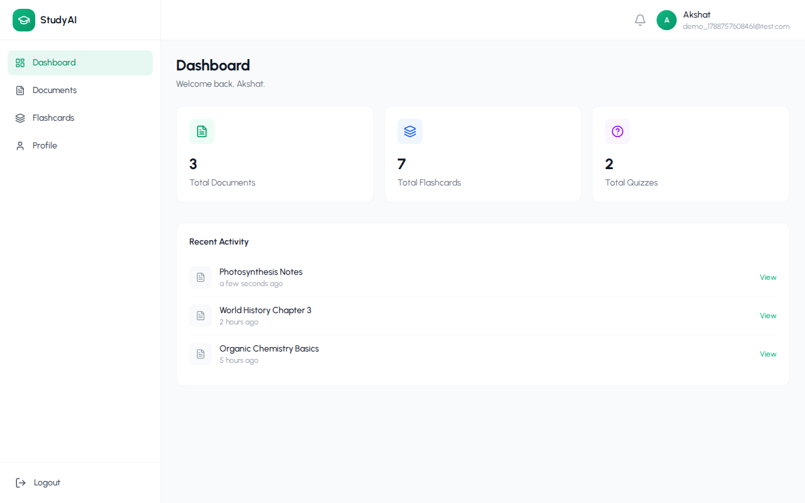
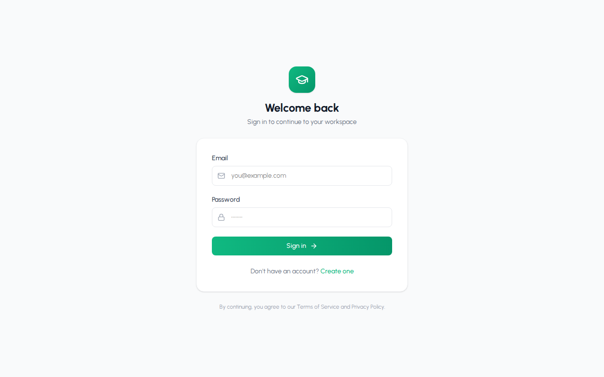
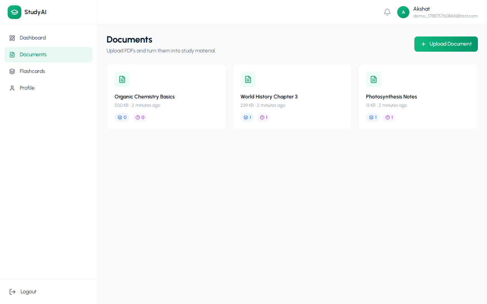
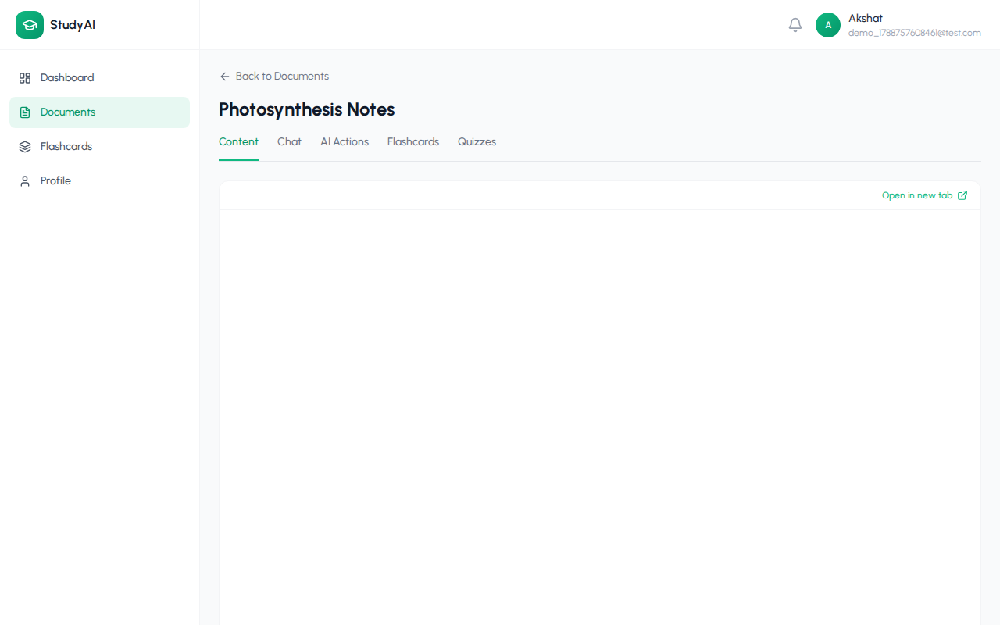
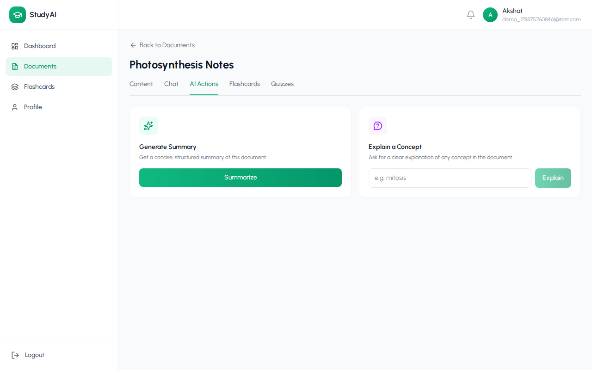
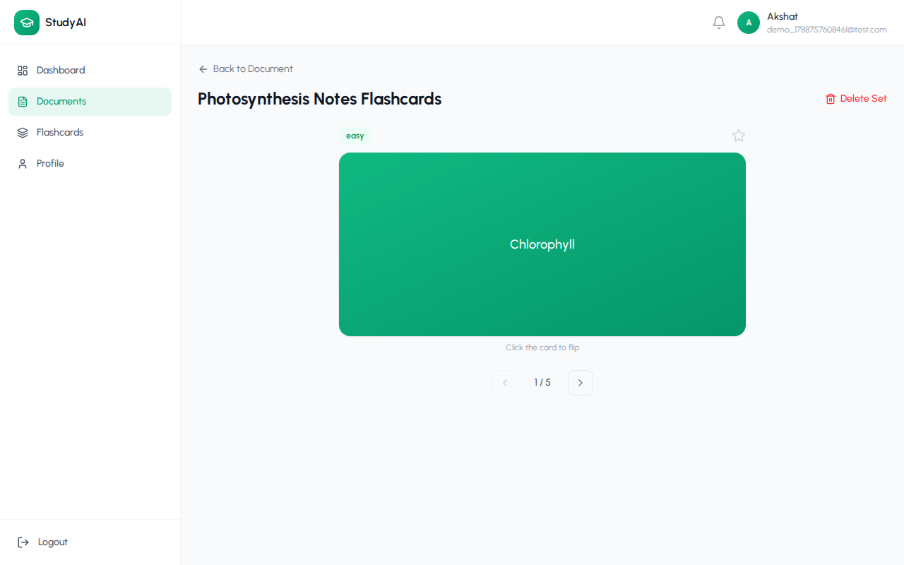
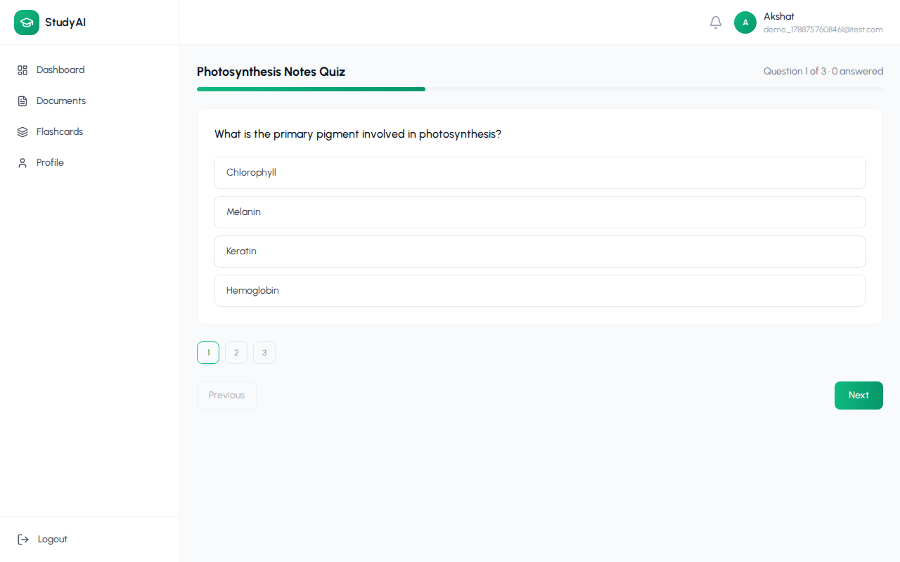

# AI-Powered Learning Assistant

Upload a PDF, read it in-app, and turn it into AI chat, summaries, concept
explanations, flashcards, and quizzes — with progress tracking. A MERN stack
app (MongoDB, Express, React, Node) with an LLM layer for the AI features.



## Features

- **Auth** — JWT-based register/login, protected routes, password change
- **Documents** — drag-and-drop PDF upload (10MB limit), text extraction, in-app viewer
- **AI Chat** — ask questions about a document, with markdown + code-highlighted replies
- **AI Actions** — one-click summaries and on-demand concept explanations
- **Flashcards** — AI-generated sets, flip-card viewer with keyboard navigation, per-card review tracking and progress bars
- **Quizzes** — AI-generated multiple-choice quizzes, server-side grading, detailed results with explanations
- **Dashboard** — document/flashcard/quiz counts and recent activity at a glance

## Tech stack

**Frontend:** React 19, Vite, React Router v7, Tailwind CSS v4, axios,
lucide-react, react-hot-toast, moment, react-markdown + remark-gfm +
react-syntax-highlighter.

**Backend:** Node.js, Express 5, MongoDB + Mongoose, JWT auth, bcryptjs,
multer (uploads), pdf-parse (text extraction), the OpenAI API for AI
generation, helmet + compression + express-rate-limit for hardening.

> The original plan targeted Google Gemini; this build uses the OpenAI API
> instead. The AI layer (`backend/utils/aiClient.js`) is a single thin
> wrapper, so swapping providers again only means changing that one file.

## Screenshots

| | |
|---|---|
|  |  |
|  |  |
|  |  |

## Project structure

```
backend/
├── config/           db.js
├── controllers/      auth, document, ai, flashcard, quiz, dashboard
├── middlewares/      auth, upload, error, rate limiter
├── models/           User, Document, Flashcard, Quiz, ChatHistory
├── routes/           one router per resource, mounted under /api/*
├── utils/            generateToken, aiClient, prompts, getOwnedDocument
├── uploads/           (gitignored) stored PDFs
└── server.js

frontend/ai-learning-assistant/src/
├── components/       layout/, documents/, flashcards/, ui/, auth/
├── context/          AuthContext.jsx
├── hooks/            useAuth.js
├── pages/            Auth/, Dashboard/, Documents/, Flashcards/, Quizzes/, Profile/
├── services/         one module per API resource
├── utils/            axiosInstance, apiPaths, constants, helpers
└── App.jsx
```

## Setup

### Prerequisites

- Node.js 20+
- A MongoDB instance (local or [Atlas](https://www.mongodb.com/atlas))
- An [OpenAI API key](https://platform.openai.com/api-keys) (for the AI features)

### Backend

```bash
cd backend
npm install
cp .env.example .env   # fill in the values below
npm run dev             # http://localhost:8000
```

`backend/.env`:

```
PORT=8000
MONGO_URI=<your MongoDB connection string>
JWT_SECRET=<long random string>
JWT_EXPIRES_IN=7d
OPENAI_API_KEY=<your OpenAI API key>
OPENAI_MODEL=gpt-4o-mini
CLIENT_URL=http://localhost:5173
```

### Frontend

```bash
cd frontend/ai-learning-assistant
npm install
cp .env.example .env   # fill in the value below
npm run dev             # http://localhost:5173
```

`frontend/ai-learning-assistant/.env`:

```
VITE_API_BASE_URL=http://localhost:8000
```

Then open `http://localhost:5173`, register an account, and upload a PDF.

## Scripts

| Location | Script | Purpose |
|---|---|---|
| `backend/` | `npm run dev` | Start the API with nodemon (auto-restart) |
| `backend/` | `npm start` | Start the API with plain node |
| `frontend/ai-learning-assistant/` | `npm run dev` | Start the Vite dev server |
| `frontend/ai-learning-assistant/` | `npm run build` | Production build to `dist/` |
| `frontend/ai-learning-assistant/` | `npm run lint` | Run ESLint |

## Notes

- AI routes are rate-limited (30 requests / 15 min per user) and guarded
  against documents with no extractable text (e.g. scanned PDFs).
- Quiz answer keys are never sent to the client until a quiz is submitted —
  grading happens server-side.
- Uploaded files are stored on local disk under `backend/uploads/`; for a
  production deploy with an ephemeral filesystem, swap in S3/Cloudinary.
